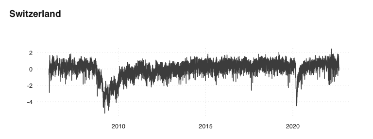
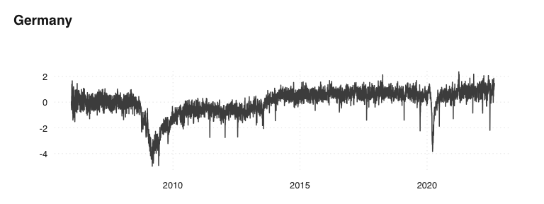

<!-- README.md is generated from README.Rmd. Please edit that file -->

# trendEcon data repository

We construct economic indicators for Switzerland, based on Google Trends
data.

The data is displayed and described at: <https://www.trendecon.org>

### Data

The data is stored as CSV in the
[`data`](https://github.com/trendecon/data/tree/master/data)
folder:

| Description              | Daily                                                                                                    | Weekly                                                                                                   | Monthly                                                                                                  |
| ------------------------ | -------------------------------------------------------------------------------------------------------- | -------------------------------------------------------------------------------------------------------- | -------------------------------------------------------------------------------------------------------- |
| clothing                 | [clothing\_d.csv](https://raw.githubusercontent.com/trendecon/data/master/raw/ch/clothing_d.csv)         | [clothing\_w.csv](https://raw.githubusercontent.com/trendecon/data/master/raw/ch/clothing_w.csv)         | [clothing\_m.csv](https://raw.githubusercontent.com/trendecon/data/master/raw/ch/clothing_m.csv)         |
| food delivery            | [fooddelivery\_d.csv](https://raw.githubusercontent.com/trendecon/data/master/raw/ch/fooddelivery_d.csv) | [fooddelivery\_w.csv](https://raw.githubusercontent.com/trendecon/data/master/raw/ch/fooddelivery_w.csv) | [fooddelivery\_m.csv](https://raw.githubusercontent.com/trendecon/data/master/raw/ch/fooddelivery_m.csv) |
| garden                   | [garden\_d.csv](https://raw.githubusercontent.com/trendecon/data/master/raw/ch/garden_d.csv)             | [garden\_w.csv](https://raw.githubusercontent.com/trendecon/data/master/raw/ch/garden_w.csv)             | [garden\_m.csv](https://raw.githubusercontent.com/trendecon/data/master/raw/ch/garden_m.csv)             |
| home office equipment    | [homeoffice\_d.csv](https://raw.githubusercontent.com/trendecon/data/master/raw/ch/homeoffice_d.csv)     | [homeoffice\_w.csv](https://raw.githubusercontent.com/trendecon/data/master/raw/ch/homeoffice_w.csv)     | [homeoffice\_m.csv](https://raw.githubusercontent.com/trendecon/data/master/raw/ch/homeoffice_m.csv)     |
| luxury                   | [luxury\_d.csv](https://raw.githubusercontent.com/trendecon/data/master/raw/ch/luxury_d.csv)             | [luxury\_w.csv](https://raw.githubusercontent.com/trendecon/data/master/raw/ch/luxury_w.csv)             | [luxury\_m.csv](https://raw.githubusercontent.com/trendecon/data/master/raw/ch/luxury_m.csv)             |
| mobility                 | [mobility\_d.csv](https://raw.githubusercontent.com/trendecon/data/master/raw/ch/mobility_d.csv)         | [mobility\_w.csv](https://raw.githubusercontent.com/trendecon/data/master/raw/ch/mobility_w.csv)         | [mobility\_m.csv](https://raw.githubusercontent.com/trendecon/data/master/raw/ch/mobility_m.csv)         |
| social                   | [social\_d.csv](https://raw.githubusercontent.com/trendecon/data/master/raw/ch/social_d.csv)             | [social\_w.csv](https://raw.githubusercontent.com/trendecon/data/master/raw/ch/social_w.csv)             | [social\_m.csv](https://raw.githubusercontent.com/trendecon/data/master/raw/ch/social_m.csv)             |
| travel                   | [travel\_d.csv](https://raw.githubusercontent.com/trendecon/data/master/raw/ch/travel_d.csv)             | [travel\_w.csv](https://raw.githubusercontent.com/trendecon/data/master/raw/ch/travel_w.csv)             | [travel\_m.csv](https://raw.githubusercontent.com/trendecon/data/master/raw/ch/travel_m.csv)             |
| trendecon main indicator | [trendecon\_d.csv](https://raw.githubusercontent.com/trendecon/data/master/raw/ch/trendecon_d.csv)       | [trendecon\_w.csv](https://raw.githubusercontent.com/trendecon/data/master/raw/ch/trendecon_w.csv)       | [trendecon\_m.csv](https://raw.githubusercontent.com/trendecon/data/master/raw/ch/trendecon_m.csv)       |

### Example

The following R code download and displays the main indicator for CH,
DE, ant AT:

``` r

data <- read.csv("https://raw.githubusercontent.com/trendecon/data/master/data/ch/trendecon_sa.csv")
tsbox::ts_plot(data, title = "Switzerland")
```

<!-- -->

``` r

data <- read.csv("https://raw.githubusercontent.com/trendecon/data/master/data/de/trendecon_sa.csv")
tsbox::ts_plot(data, title = "Germany")
```

<!-- -->

``` r

data <- read.csv("https://raw.githubusercontent.com/trendecon/data/master/data/at/trendecon_sa.csv")
tsbox::ts_plot(data, title = "Austria")
```

<!-- -->
