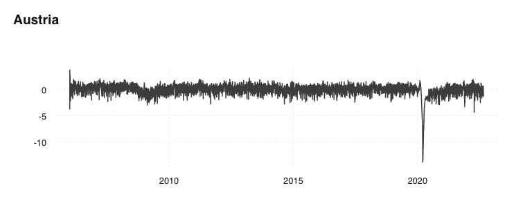

<!-- README.md is generated from README.Rmd. Please edit that file -->

# trendEcon data repository

We construct economic indicators for Switzerland, based on Google Trends
data.

The data is displayed and described at: <https://www.trendecon.org>

### Data

The data is stored as CSV in the
[`data`](https://github.com/trendecon/data/tree/master/data) folder:

| Description              | Switzerland                                                                                               | Germany                                                                                             | Austria                                                                                             |
|--------------------------|-----------------------------------------------------------------------------------------------------------|-----------------------------------------------------------------------------------------------------|-----------------------------------------------------------------------------------------------------|
| clothing                 | [clothing_sa.csv](https://raw.githubusercontent.com/trendecon/data/master/raw/ch/clothing_sa.csv)         | —                                                                                                   | —                                                                                                   |
| food delivery            | [fooddelivery_sa.csv](https://raw.githubusercontent.com/trendecon/data/master/raw/ch/fooddelivery_sa.csv) | —                                                                                                   | —                                                                                                   |
| garden                   | [garden_sa.csv](https://raw.githubusercontent.com/trendecon/data/master/raw/ch/garden_sa.csv)             | —                                                                                                   | —                                                                                                   |
| home office equipment    | [homeoffice_sa.csv](https://raw.githubusercontent.com/trendecon/data/master/raw/ch/homeoffice_sa.csv)     | —                                                                                                   | —                                                                                                   |
| luxury                   | [luxury_sa.csv](https://raw.githubusercontent.com/trendecon/data/master/raw/ch/luxury_sa.csv)             | —                                                                                                   | —                                                                                                   |
| mobility                 | [mobility_sa.csv](https://raw.githubusercontent.com/trendecon/data/master/raw/ch/mobility_sa.csv)         | —                                                                                                   | —                                                                                                   |
| social                   | [social_sa.csv](https://raw.githubusercontent.com/trendecon/data/master/raw/ch/social_sa.csv)             | —                                                                                                   | —                                                                                                   |
| travel                   | [travel_sa.csv](https://raw.githubusercontent.com/trendecon/data/master/raw/ch/travel_sa.csv)             | —                                                                                                   | —                                                                                                   |
| trendecon main indicator | [trendecon_sa.csv](https://raw.githubusercontent.com/trendecon/data/master/raw/ch/trendecon_sa.csv)       | [trendecon_sa.csv](https://raw.githubusercontent.com/trendecon/data/master/raw/de/trendecon_sa.csv) | [trendecon_sa.csv](https://raw.githubusercontent.com/trendecon/data/master/raw/at/trendecon_sa.csv) |

### Example

The following R code download and displays the main indicator for CH,
DE, ant AT:

``` r

data <- read.csv("https://raw.githubusercontent.com/trendecon/data/master/data/ch/trendecon_sa.csv")
tsbox::ts_plot(data, title = "Switzerland")
```

<!-- -->

``` r

data <- read.csv("https://raw.githubusercontent.com/trendecon/data/master/data/de/trendecon_sa.csv")
tsbox::ts_plot(data, title = "Germany")
```

<!-- -->

``` r

data <- read.csv("https://raw.githubusercontent.com/trendecon/data/master/data/at/trendecon_sa.csv")
tsbox::ts_plot(data, title = "Austria")
```

<!-- -->
